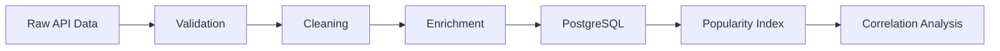
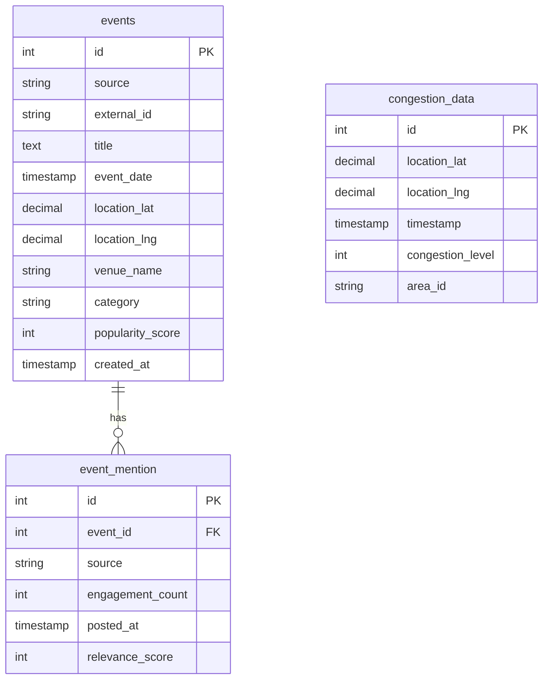
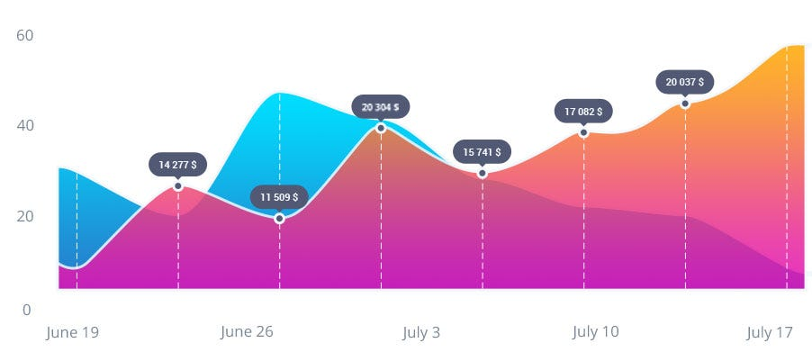
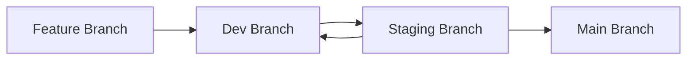
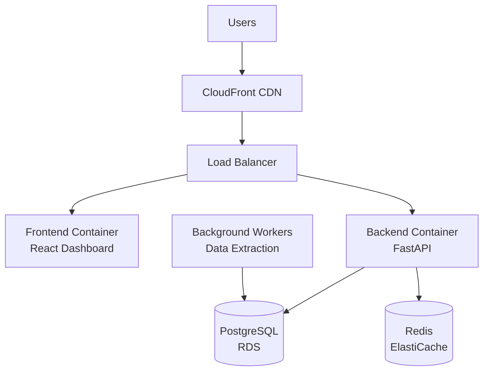
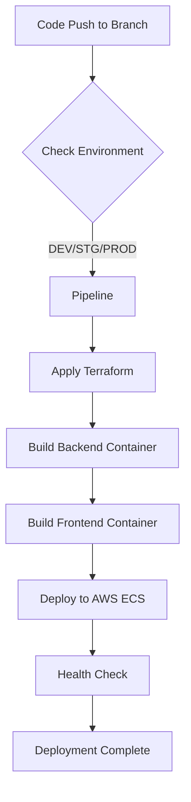

# Citisense Engineering Design Document

## Data Pipeline (ETL)

### Data Processing Flow



We would use our parser to collect data for a specific event, trying to get as much general information about it as possible. Social media posts, tickets and overall sentiment of the event.

**Validation & Cleaning**

- Remove duplicates by external_id
- Normalize dates to UTC timestamps
- Geocode UK addresses
- Filter spam (irrelevant keywords, duplicate posts)
- Check for SQL injections
- Add structure to the data

**Data Enrichment**

- Categorize events (music, sports, festivals, etc.)
- Sentiment analysis on social mentions using VADER to determine if people are positive or negative about the upcoming event
- Add area_id based on UK postcode districts

**Schema Design**

Each popular event will be stored in our database with unique id. We will store all relevant information regarding the event including it's address and popularity score that will be updated automatically based on new information we will collect before, during and after event. 

We will be storing event mentions like social media posts, articles and google trends as another entity linking it back to the event itself. We can calculate the popularity score based on the amount of mentions and overall sentiment of them. We could assume that the more positive the sentiment is the more popular the event will be.



**Congestion Correlation**

Using live data like Apple Mobility for phone clustering certain area, traffic diversions from TomTom, as well as our historic data (if we have it), would correlate to event popularity.

- Use apple mobility for getting readings on people in the area of an event
- Use TomTom for information like traffic and route diversion
- Match events within 1km radius of congestion sensors
- Compare congestion 2hrs before/during/after event
- Flag strong correlations (r > 0.7) as insights


## Backend API

**REST Endpoints (FastAPI)**

```python
GET  /api/v1/events/popular?lat={lat}&lng={lng}&radius={km}&date={date}
GET  /api/v1/events/trending?limit=10&days=7
POST /api/v1/events/search  # Body: {keyword, date_range, location}
GET  /api/v1/correlation/{area_id}?date={date}
GET  /api/v1/insights/hotspots?threshold=0.7
GET  /api/v1/health
```

**API Endpoint Descriptions:**

- **`GET /api/v1/events/popular`** - Returns popular events within a specified radius of coordinates for a given date. Used by the map view to show event density in specific areas.

- **`GET /api/v1/events/trending`** - Fetches currently trending events based on recent social media activity and search volume. Powers the "trending now" dashboard widget.

- **`POST /api/v1/events/search`** - Advanced search endpoint accepting complex queries with keywords, date ranges, and location filters. Supports the main search functionality.

- **`GET /api/v1/correlation/{area_id}`** - Retrieves correlation analysis between events and congestion for a specific area on a given date. Provides insights for urban planning.

- **`GET /api/v1/insights/hotspots`** - Identifies areas with strong event-congestion correlations above the specified threshold. Highlights problem areas for traffic management.

- **`GET /api/v1/health`** - System health check endpoint for monitoring and load balancer health verification. Returns service status and database connectivity.

**Error Handling**
- Pydantic models for request validation
- Standard HTTP codes: 400 (bad request), 404 (not found), 429 (rate limit), 500 (error)
- Structured JSON errors: `{"error": "Invalid date format", "field": "date"}`

**Caching Strategy**
- Redis: API responses cached 15min, correlation results 1hr
- Cache key format: `popular_events:{lat}:{lng}:{radius}:{date}`

**Logging and Alarms**
- Logging: Set up CloudWatch logging to store logs of the execution
- Alarms: Set up an Alarm for every time an error occurs (e.g. Unable to retrieve API keys)


## Stage 4: Frontend Dashboard


**Key Features**
- **Interactive Map**: Leaflet.js heatmap with event markers and congestion overlay
- **Time Series Chart**: Popularity trends over 7/30/90 days
- **Correlation View**: Side-by-side event/congestion graphs for comparison
- **Search**: Location autocomplete, date picker, category filters

**Tech Stack**
- React + TypeScript
- Redux for state management
- Leaflet.js for maps
- Chart.js for visualizations

**Mobile-First Design**
- Responsive grid layout
- Progressive Web App (PWA) for offline capability
- Auto-refresh every 5 minutes

## Stage 5: Deployment

We would use Docker for deploying Frontend and Backend as containers. The upsides of it will be ease of testing and set up locally, as well as simple deployment running process. Unfortunately the costs can start scaling up high in case of using EC2 instances for running this software.

For providing Cloud Architecture we would use Terraform as it will make it easy to keep track of growing architecture with time.

**Containerization**
```dockerfile
FROM python:3.11-slim
WORKDIR /app
COPY requirements.txt .
RUN pip install --no-cache-dir -r requirements.txt
COPY . .
EXPOSE 8000
CMD ["uvicorn", "main:app", "--host", "0.0.0.0"]
```

### Deployment stages

We would use a standard deployment paradigm. Creating a feature branch with new feature. Upon merging it into Dev it would be deployed in Dev env. From Dev env it will be promoted into Staging if all testing is successful. In Staging we would let a limited amount of people test it. If feature is successful we deploy it to Main into prod otherwise reworks will be made in Dev until the feature is ready. Each state can be rolled back at any time.


**AWS Architecture**

We would use AWS CloudFront for resolving domain referencing. All requests would be handled via Load Balancer that will equally distribute all traffic. Frontend will be running in a separate container as well as the backend. Requests for getting the data will go through our cache if cache doesn't have it then we will attempt to get the data from Database.



**CI/CD Pipeline (GitHub Actions)**

We would set up GitHub actions to trigger upon merging the code into the three key envs (DEV, STG, PROD), and we would read in what branch the code is to determine where we are deploying. First we deploy all the necessary infrastructure like Database using terraform apply. We would then build the images of backend and frontend and deploy them to AWS.




**Security**
- JWT authentication (1hr expiry)
- Rate limiting: 100 req/min per API key
- HTTPS only (TLS 1.3)

## Scalability & Costs

**Cost Optimization**
- Reserved instances for API (save 40%)
- Spot instances for batch jobs (save 70%)
- Archive data >1yr to S3 Glacier


## Further Improvements

### Serverless deployment

- A great option would be to rework the backend into a series of lambdas. Each API path would be a lambda. The cold start is slow but executions cost nothing and can be very efficient.
- Code quality tools run on every deployment to make sure the code is clean and secure
- Using AWS Cognito for user authentication and permission
- Implement Role Based Access control for all of the application
- Create a predictive model using AWS SageMaker for predicting future event popularity based on our historic and live data